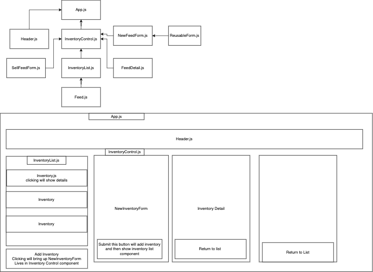

# Sneed's Feed and Seed
## By Liam Campbell
## A react Inventory tracker.

### Technologies Used

* Node
* CSS
* React
* Bootstrap
* Babel
* Es-Linter

## Description
_This is a simple inventory tracker that can be used to track any weighted inventory. It is specailly designed to track inventories that may be broken up for a partial purchase. A user can enter the weight, name, price per pound, and total quantity of bags that they have for sale and then keep track of the amount left over after each sale._ 

## Setup/Installation Requirements

* Clone this repository from https://github.com/lcmpbll/SneedsFeedNSeed.git to your desktop
* Navigate to the top level of the directory
* In your terminal console `$cd to sneeds-feed-n-seed`
* `$npm install`
* `$npm run start`

## Known Bugs
_Currently lbs of remaining inventory in the bag does not calculate exactly_

## License

[Copyright](LICENSE) (c) _09/09/2022 Liam Campbell_

### Contact infromation

_Feel free to reach out via [github](https://github.com/lcmpbll)

